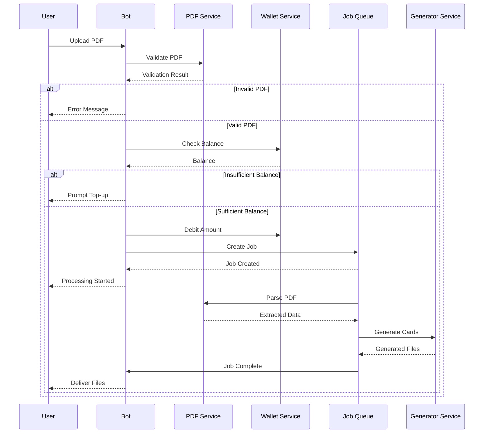
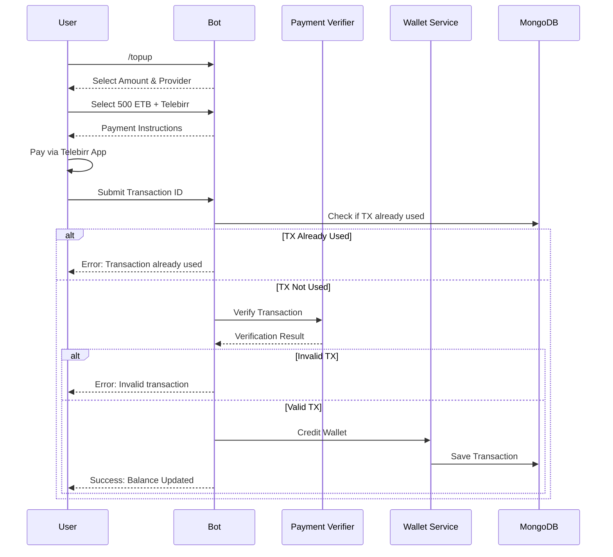

# Design Document: eFayda ID Card Generator Telegram Bot

## Overview

This design document describes the architecture and implementation of a Telegram Bot that converts Ethiopian National ID (eFayda) PDF documents into print-ready ID cards. The system follows a modular, event-driven architecture with separate services for PDF parsing, image generation, payment verification, and bot interaction.

The system processes eFayda PDFs through a pipeline: validation → extraction → generation → delivery, with payment verification gating the generation step. A job queue handles asynchronous processing to ensure responsiveness and scalability.

## Architecture

```
┌─────────────────────────────────────────────────────────────────────────────┐
│                              Telegram Bot API                                │
└─────────────────────────────────────────────────────────────────────────────┘
                                      │
                                      ▼
┌─────────────────────────────────────────────────────────────────────────────┐
│                           Bot Handler Layer                                  │
│  ┌──────────┐ ┌──────────┐ ┌──────────┐ ┌──────────┐ ┌──────────┐          │
│  │ /start   │ │ /upload  │ │ /topup   │ │ /balance │ │ /language│          │
│  └──────────┘ └──────────┘ └──────────┘ └──────────┘ └──────────┘          │
└─────────────────────────────────────────────────────────────────────────────┘
                                      │
                    ┌─────────────────┼─────────────────┐
                    ▼                 ▼                 ▼
┌─────────────────────────┐ ┌─────────────────┐ ┌─────────────────────────────┐
│    PDF Service          │ │ Payment Service │ │      User Service           │
│  ┌───────────────────┐  │ │ ┌─────────────┐ │ │  ┌───────────────────────┐  │
│  │ PDF Validator     │  │ │ │ Telebirr    │ │ │  │ Wallet Manager        │  │
│  │ PDF Parser        │  │ │ │ Verifier    │ │ │  │ Language Manager      │  │
│  │ Data Normalizer   │  │ │ ├─────────────┤ │ │  │ Settings Manager      │  │
│  └───────────────────┘  │ │ │ CBE Birr    │ │ │  └───────────────────────┘  │
└─────────────────────────┘ │ │ Verifier    │ │ └─────────────────────────────┘
                            │ └─────────────┘ │
                            └─────────────────┘
                                      │
                                      ▼
┌─────────────────────────────────────────────────────────────────────────────┐
│                              Job Queue (Bull)                                │
│  ┌──────────────────────────────────────────────────────────────────────┐   │
│  │  PDF Processing Jobs → ID Generation Jobs → Delivery Jobs            │   │
│  └──────────────────────────────────────────────────────────────────────┘   │
└─────────────────────────────────────────────────────────────────────────────┘
                                      │
                                      ▼
┌─────────────────────────────────────────────────────────────────────────────┐
│                         ID Generation Service                                │
│  ┌─────────────────┐  ┌─────────────────┐  ┌─────────────────────────────┐  │
│  │ Card Renderer   │  │ Image Processor │  │ PDF Generator               │  │
│  │ (Canvas/Sharp)  │  │ (Sharp)         │  │ (PDFKit)                    │  │
│  └─────────────────┘  └─────────────────┘  └─────────────────────────────┘  │
└─────────────────────────────────────────────────────────────────────────────┘
                                      │
                                      ▼
┌─────────────────────────────────────────────────────────────────────────────┐
│                              Data Layer                                      │
│  ┌─────────────────┐  ┌─────────────────┐  ┌─────────────────────────────┐  │
│  │ MongoDB         │  │ Redis           │  │ File Storage (Temp)         │  │
│  │ - Users         │  │ - Job Queue     │  │ - Uploaded PDFs             │  │
│  │ - Transactions  │  │ - Rate Limits   │  │ - Generated Files           │  │
│  │ - Jobs          │  │ - Sessions      │  │ - Auto-cleanup              │  │
│  └─────────────────┘  └─────────────────┘  └─────────────────────────────┘  │
└─────────────────────────────────────────────────────────────────────────────┘
```

## Components and Interfaces

### 1. Bot Handler Layer

```typescript
// src/bot/handlers/types.ts
interface BotContext {
  userId: string;
  chatId: number;
  language: Language;
  user: User;
}

interface CommandHandler {
  command: string;
  description: Record<Language, string>;
  handler: (ctx: BotContext, args?: string[]) => Promise<void>;
}

// src/bot/handlers/startHandler.ts
interface StartHandler extends CommandHandler {
  command: '/start';
  handler: (ctx: BotContext) => Promise<void>;
}

// src/bot/handlers/uploadHandler.ts
interface UploadHandler {
  handleDocument: (ctx: BotContext, document: TelegramDocument) => Promise<void>;
  validatePDF: (fileBuffer: Buffer) => Promise<ValidationResult>;
}

// src/bot/handlers/paymentHandler.ts
interface PaymentHandler {
  handleTopup: (ctx: BotContext) => Promise<void>;
  handleTransactionId: (ctx: BotContext, txId: string, provider: PaymentProvider) => Promise<void>;
}
```

### 2. PDF Service

```typescript
// src/services/pdf/types.ts
interface EfaydaData {
  // Personal Information
  fullNameAmharic: string;
  fullNameEnglish: string;
  dateOfBirthEthiopian: string;
  dateOfBirthGregorian: string;
  sex: 'Male' | 'Female';
  nationality: string;
  phoneNumber: string;
  
  // Address
  region: string;
  city: string;
  subcity: string;
  
  // Identifiers
  fcn: string;  // Fayda Card Number
  fin: string;  // Fayda Identification Number
  fan: string;  // Fayda Account Number
  serialNumber: string;
  
  // Dates
  issueDate: string;
  expiryDate: string;
  
  // Images (Base64)
  photo: string;
  qrCode: string;
  barcode: string;
}

interface ValidationResult {
  isValid: boolean;
  errors: string[];
}

// src/services/pdf/pdfParser.ts
interface PDFParser {
  validate(buffer: Buffer): Promise<ValidationResult>;
  parse(buffer: Buffer): Promise<EfaydaData>;
  extractImages(buffer: Buffer): Promise<ExtractedImages>;
}

interface ExtractedImages {
  photo: Buffer;
  qrCode: Buffer;
  barcode: Buffer;
}
```

### 3. Payment Service

```typescript
// src/services/payment/types.ts
type PaymentProvider = 'telebirr' | 'cbe';

interface TransactionVerification {
  isValid: boolean;
  amount?: number;
  receiver?: string;
  sender?: string;
  timestamp?: Date;
  error?: string;
}

// src/services/payment/telebirrVerifier.ts
interface TelebirrVerifier {
  verify(transactionId: string): Promise<TransactionVerification>;
  validateReceiver(verification: TransactionVerification, expectedReceiver: string): boolean;
}

// src/services/payment/cbeVerifier.ts
interface CBEVerifier {
  verify(transactionId: string): Promise<TransactionVerification>;
  validateReceiver(verification: TransactionVerification, expectedReceiver: string): boolean;
}

// src/services/payment/walletService.ts
interface WalletService {
  getBalance(userId: string): Promise<number>;
  credit(userId: string, amount: number, transactionId: string): Promise<void>;
  debit(userId: string, amount: number, jobId: string): Promise<boolean>;
  getTransactionHistory(userId: string): Promise<WalletTransaction[]>;
}

interface WalletTransaction {
  id: string;
  userId: string;
  type: 'credit' | 'debit';
  amount: number;
  reference: string;
  timestamp: Date;
}
```

### 4. ID Generation Service

```typescript
// src/services/generator/types.ts
interface CardGeneratorOptions {
  variant: 'color' | 'grayscale';
  mirrored: boolean;
  dpi: number;
}

interface GeneratedCard {
  front: Buffer;
  back: Buffer;
  combined: Buffer;
}

// src/services/generator/cardRenderer.ts
interface CardRenderer {
  renderFront(data: EfaydaData, options: CardGeneratorOptions): Promise<Buffer>;
  renderBack(data: EfaydaData, options: CardGeneratorOptions): Promise<Buffer>;
  combineFrontBack(front: Buffer, back: Buffer, options: CardGeneratorOptions): Promise<Buffer>;
}

// src/services/generator/pdfGenerator.ts
interface PDFGenerator {
  generateA4(cards: GeneratedCard, options: CardGeneratorOptions): Promise<Buffer>;
}

// src/services/generator/imageProcessor.ts
interface ImageProcessor {
  mirror(image: Buffer): Promise<Buffer>;
  toGrayscale(image: Buffer): Promise<Buffer>;
  resize(image: Buffer, width: number, height: number): Promise<Buffer>;
  applyMask(image: Buffer, maskShape: 'rounded' | 'oval'): Promise<Buffer>;
}
```

### 5. Job Queue Service

```typescript
// src/services/queue/types.ts
interface JobData {
  userId: string;
  chatId: number;
  pdfPath: string;
  language: Language;
}

interface JobResult {
  success: boolean;
  files?: GeneratedFiles;
  error?: string;
}

interface GeneratedFiles {
  colorMirroredPng: string;
  grayscaleMirroredPng: string;
  colorMirroredPdf: string;
  grayscaleMirroredPdf: string;
}

// src/services/queue/jobProcessor.ts
interface JobProcessor {
  process(job: Job<JobData>): Promise<JobResult>;
  onComplete(job: Job<JobData>, result: JobResult): Promise<void>;
  onFailed(job: Job<JobData>, error: Error): Promise<void>;
}
```

### 6. User Service

```typescript
// src/services/user/types.ts
type Language = 'en' | 'am' | 'ti';

interface User {
  id: string;
  telegramId: number;
  language: Language;
  walletBalance: number;
  createdAt: Date;
  updatedAt: Date;
}

interface UserSettings {
  language: Language;
  notifications: boolean;
}

// src/services/user/userService.ts
interface UserService {
  findOrCreate(telegramId: number): Promise<User>;
  updateLanguage(userId: string, language: Language): Promise<void>;
  getSettings(userId: string): Promise<UserSettings>;
  updateSettings(userId: string, settings: Partial<UserSettings>): Promise<void>;
}
```

## Data Models

### MongoDB Schemas

```typescript
// src/models/User.ts
const UserSchema = new Schema({
  telegramId: { type: Number, required: true, unique: true, index: true },
  language: { type: String, enum: ['en', 'am', 'ti'], default: 'en' },
  walletBalance: { type: Number, default: 0, min: 0 },
  settings: {
    notifications: { type: Boolean, default: true }
  },
  createdAt: { type: Date, default: Date.now },
  updatedAt: { type: Date, default: Date.now }
});

// src/models/Transaction.ts
const TransactionSchema = new Schema({
  userId: { type: Schema.Types.ObjectId, ref: 'User', required: true, index: true },
  type: { type: String, enum: ['credit', 'debit'], required: true },
  amount: { type: Number, required: true },
  provider: { type: String, enum: ['telebirr', 'cbe', 'system'] },
  externalTransactionId: { type: String, sparse: true, unique: true },
  reference: { type: String },  // jobId for debits
  status: { type: String, enum: ['pending', 'completed', 'failed'], default: 'completed' },
  metadata: { type: Schema.Types.Mixed },
  createdAt: { type: Date, default: Date.now }
});

// src/models/Job.ts
const JobSchema = new Schema({
  userId: { type: Schema.Types.ObjectId, ref: 'User', required: true, index: true },
  chatId: { type: Number, required: true },
  status: { type: String, enum: ['pending', 'processing', 'completed', 'failed'], default: 'pending' },
  pdfPath: { type: String },
  extractedData: { type: Schema.Types.Mixed },
  outputFiles: [{
    type: { type: String },
    path: { type: String },
    deliveredAt: { type: Date }
  }],
  attempts: { type: Number, default: 0 },
  error: { type: String },
  createdAt: { type: Date, default: Date.now },
  completedAt: { type: Date },
  expiresAt: { type: Date, index: true }  // TTL index for auto-cleanup
});

// src/models/UsedTransaction.ts
const UsedTransactionSchema = new Schema({
  transactionId: { type: String, required: true, unique: true },
  provider: { type: String, enum: ['telebirr', 'cbe'], required: true },
  userId: { type: Schema.Types.ObjectId, ref: 'User', required: true },
  amount: { type: Number, required: true },
  usedAt: { type: Date, default: Date.now }
});
```

## Sequence Diagrams

### PDF Upload and Processing Flow



### Payment Verification Flow



## Error Handling

### Error Categories and Responses

```typescript
// src/errors/types.ts
enum ErrorCode {
  // PDF Errors (1xxx)
  PDF_INVALID_FORMAT = 1001,
  PDF_NOT_EFAYDA = 1002,
  PDF_CORRUPTED = 1003,
  PDF_PARSE_FAILED = 1004,
  
  // Payment Errors (2xxx)
  PAYMENT_TX_INVALID = 2001,
  PAYMENT_TX_ALREADY_USED = 2002,
  PAYMENT_TX_WRONG_AMOUNT = 2003,
  PAYMENT_TX_WRONG_RECEIVER = 2004,
  PAYMENT_INSUFFICIENT_BALANCE = 2005,
  
  // Generation Errors (3xxx)
  GENERATION_FAILED = 3001,
  GENERATION_TIMEOUT = 3002,
  
  // System Errors (4xxx)
  RATE_LIMIT_EXCEEDED = 4001,
  SERVICE_UNAVAILABLE = 4002
}

interface AppError {
  code: ErrorCode;
  message: Record<Language, string>;
  retryable: boolean;
}

// Error messages are localized
const ERROR_MESSAGES: Record<ErrorCode, Record<Language, string>> = {
  [ErrorCode.PDF_INVALID_FORMAT]: {
    en: 'Invalid PDF format. Please upload a valid PDF file.',
    am: 'ልክ ያልሆነ PDF ቅርጸት። እባክዎ ትክክለኛ PDF ፋይል ይስቀሉ።',
    ti: 'ቅኑዕ ዘይኮነ PDF ቅርጺ። በጃኹም ቅኑዕ PDF ፋይል ጸዓኑ።'
  },
  // ... more error messages
};
```

### Retry Strategy

```typescript
// src/services/queue/retryStrategy.ts
const RETRY_CONFIG = {
  maxAttempts: 3,
  backoff: {
    type: 'exponential',
    delay: 1000,  // 1s, 2s, 4s
  },
  retryableErrors: [
    ErrorCode.GENERATION_FAILED,
    ErrorCode.SERVICE_UNAVAILABLE
  ]
};
```

## Testing Strategy

### Testing Approach

The system uses a dual testing approach:
- **Unit tests**: Verify specific examples, edge cases, and error conditions
- **Property-based tests**: Verify universal properties across all inputs using fast-check

### Test Configuration

```typescript
// jest.config.js
module.exports = {
  preset: 'ts-jest',
  testEnvironment: 'node',
  testMatch: ['**/*.test.ts', '**/*.property.test.ts'],
  setupFilesAfterEnv: ['./jest.setup.ts'],
  coverageThreshold: {
    global: {
      branches: 80,
      functions: 80,
      lines: 80
    }
  }
};
```

### Property-Based Testing Library

The system uses `fast-check` for property-based testing with minimum 100 iterations per property.

```typescript
import fc from 'fast-check';

// Example property test structure
describe('Property Tests', () => {
  it('should satisfy property', () => {
    fc.assert(
      fc.property(
        fc.string(),
        (input) => {
          // Property assertion
          return true;
        }
      ),
      { numRuns: 100 }
    );
  });
});
```


## Correctness Properties

*A property is a characteristic or behavior that should hold true across all valid executions of a system—essentially, a formal statement about what the system should do. Properties serve as the bridge between human-readable specifications and machine-verifiable correctness guarantees.*

Based on the acceptance criteria analysis, the following correctness properties have been identified:

### Property 1: File Extension Validation

*For any* file uploaded to the bot, the system SHALL accept it if and only if the file extension is `.pdf` (case-insensitive).

**Validates: Requirements 1.1**

### Property 2: Invalid PDF Rejection

*For any* buffer that is not a valid PDF (corrupted, wrong format, or empty), the parser SHALL return `isValid: false` with a non-empty error array.

**Validates: Requirements 1.3**

### Property 3: Data Persistence Round-Trip

*For any* valid EfaydaData object extracted from a PDF, storing it to MongoDB and retrieving it SHALL produce an equivalent object.

**Validates: Requirements 2.10**

### Property 4: Image Mirroring Round-Trip

*For any* valid image buffer, applying the mirror operation twice SHALL produce an image equivalent to the original.

**Validates: Requirements 3.4**

### Property 5: Grayscale Conversion Idempotence

*For any* image buffer, applying grayscale conversion twice SHALL produce the same result as applying it once (idempotent operation).

**Validates: Requirements 3.6**

### Property 6: Image Resolution Compliance

*For any* generated ID card image, the dimensions SHALL meet or exceed 300 DPI requirements for standard ID card size (85.6mm × 53.98mm), meaning minimum 1012 × 638 pixels.

**Validates: Requirements 3.10**

### Property 7: A4 PDF Page Size

*For any* generated A4 PDF, the page dimensions SHALL be exactly 210mm × 297mm (A4 standard).

**Validates: Requirements 4.1**

### Property 8: Output File Count

*For any* successfully completed job, the system SHALL produce exactly 4 output files: 2 PNG images and 2 PDF documents.

**Validates: Requirements 5.1, 5.2**

### Property 9: File Delivery Filename Format

*For any* delivered file, the filename SHALL contain the user identifier and file type descriptor, matching the pattern `{userId}_{type}_{timestamp}.{ext}`.

**Validates: Requirements 5.4**

### Property 10: Temporary File Cleanup

*For any* job that completes (success or failure), all temporary files associated with that job SHALL be deleted within 1 hour.

**Validates: Requirements 5.5, 12.2**

### Property 11: Valid Transaction Credits Wallet

*For any* valid transaction ID (from Telebirr or CBE) that has not been previously used and matches the expected amount, the user's wallet balance SHALL increase by exactly that amount.

**Validates: Requirements 6.3, 7.3**

### Property 12: Invalid/Used Transaction Rejection

*For any* transaction ID that is invalid, already used, or has wrong amount/receiver, the system SHALL reject it without modifying the user's wallet balance.

**Validates: Requirements 6.4, 7.4**

### Property 13: Wallet Balance Invariant

*For any* sequence of wallet operations (credits and debits), the wallet balance SHALL always equal the sum of all credits minus the sum of all debits, and SHALL never be negative.

**Validates: Requirements 8.1, 8.4, 8.6**

### Property 14: Insufficient Balance Prevention

*For any* job submission where the user's wallet balance is less than the service fee, the system SHALL reject the job without deducting any balance.

**Validates: Requirements 8.5**

### Property 15: Localization Completeness

*For any* user-facing message key in the system, translations SHALL exist for all three supported languages (English, Amharic, Tigrigna).

**Validates: Requirements 10.1, 10.2, 10.3, 10.5**

### Property 16: Job Retry Limit

*For any* job that fails, the system SHALL retry at most 3 times before marking it as permanently failed.

**Validates: Requirements 11.3**

### Property 17: Failed Job Refund

*For any* job that fails permanently after all retries, the user's wallet SHALL be credited back the full service fee that was deducted.

**Validates: Requirements 11.4**

### Property 18: Rate Limiting

*For any* user, the system SHALL reject requests exceeding 10 per minute with an appropriate rate limit error.

**Validates: Requirements 12.4**

### Property 19: Transaction ID Uniqueness

*For any* transaction ID, it SHALL be usable for wallet credit at most once across all users and all time.

**Validates: Requirements 6.4, 7.4**

### Property 20: Top-up Amount Options

*For any* top-up request, the system SHALL present exactly 8 options with values [100, 200, 300, 400, 500, 600, 800, 1000] ETB.

**Validates: Requirements 8.3**
